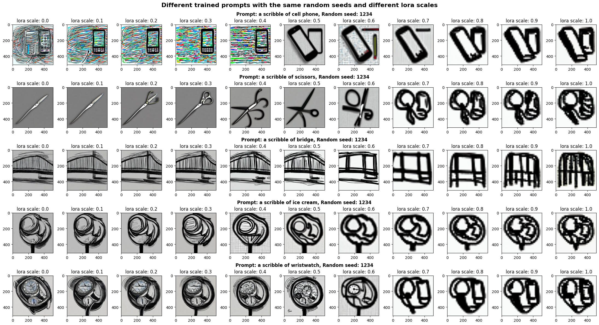

# Fine-Tuning Stable Diffusion Model with LoRA for Style-Specific Image Generation

 In this I am project trying to train a diffusion model for scribble image generation.

## Dataset
* https://huggingface.co/datasets/quickdraw
* https://github.com/googlecreativelab/quickdraw-dataset
* https://console.cloud.google.com/storage/browser/quickdraw_dataset/full/numpy_bitmap%3Btab=objects?prefix=&forceOnObjectsSortingFiltering=false

## Result

